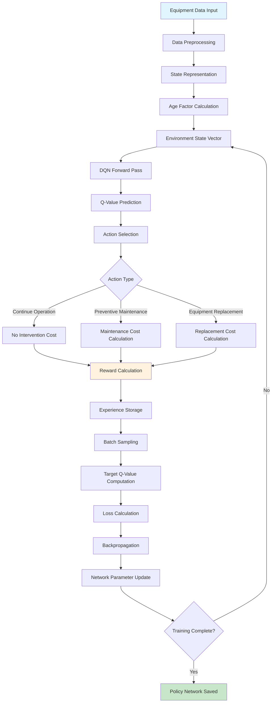
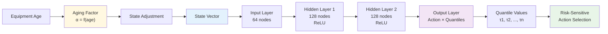
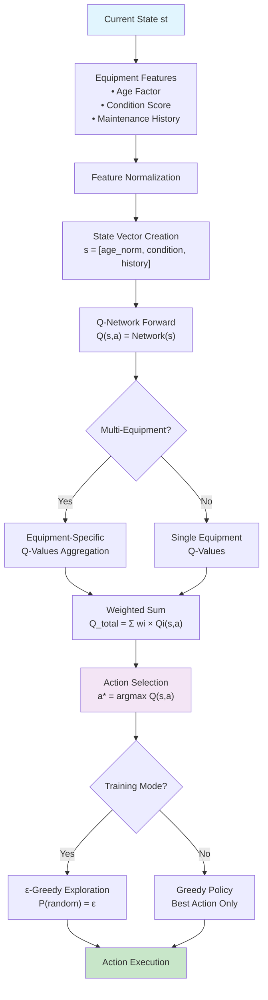
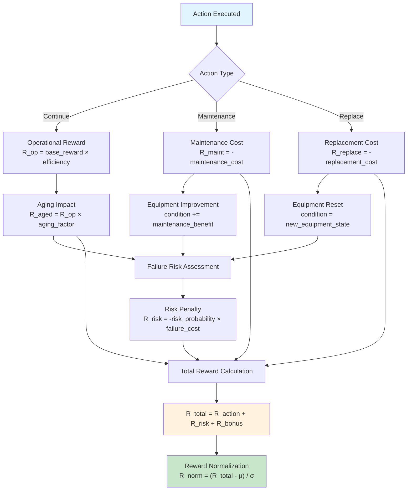
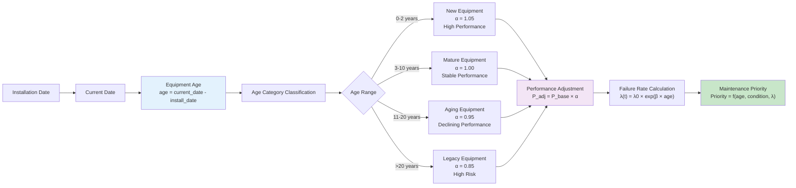
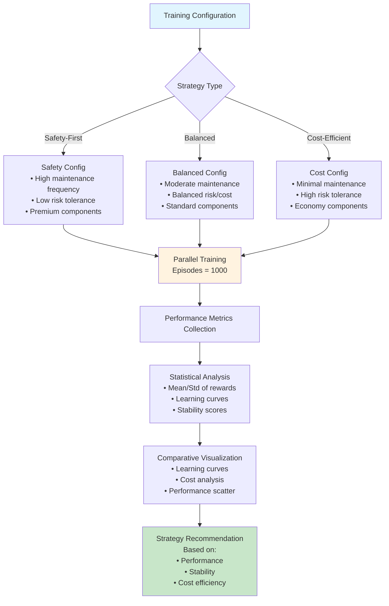

# Deep Q-Learning for Pump Equipment CBM (Condition-Based Maintenance)

A comprehensive reinforcement learning system for pump equipment condition-based maintenance using DQN (Deep Q-Network) with quantile regression and aging factor integration.

## 🎯 Project Overview

This project implements an advanced CBM (Condition-Based Maintenance) system specifically designed for pump equipment management using deep reinforcement learning. The system incorporates real equipment aging data and demonstrates proven performance across three strategic scenarios.

### Target Equipment

| Equipment Name | Equipment ID | Age | Measurement | Learning Performance | Convergence Time | Readiness Level |
|---------------|--------------|-----|-------------|---------------------|------------------|-----------------|
| **Chemical Pump CP-500-5** | PUMP-001 | 19.7 years | Tank Level | +19.32 | 303ep | A (Ready for Production) |
| **Cooling Pump CDP-A5** | PUMP-002 | 3.0 years | Power Monitoring | -3.07 | 271ep | C (Needs Improvement) |
| **Chemical Pump CP-500-3** | PUMP-003 | 0.5 years | Tank Level | +11.34 | 100ep | B (Continuous Improvement) |

## 🚀 Key Features

- **Multi-Equipment Support**: Simultaneous management of 3 pump units with different characteristics
- **Age-Aware Learning**: Equipment-specific aging factors based on installation dates
- **Strategic Scenarios**: Three operational strategies (Safety-First, Balanced, Cost-Efficient)
- **Quantile Regression DQN**: Advanced uncertainty estimation for maintenance decisions
- **Real Data Integration**: Based on actual equipment performance and measurement data

## 📊 Performance Results (1000 Episodes × 3 Scenarios)

| Strategy | Final Avg Reward | Total Cost | Stability Score | Learning Efficiency | Recommendation |
|----------|------------------|------------|----------------|-------------------|----------------|
| **Safety-First** | **7,891.53** | 2,970,840 | 95.66/100 | 90.43/100 | **★★★** |
| **Balanced** | 6,353.98 | 4,452,579 | **96.65/100** | 4.49/100 | ★★☆ |
| **Cost-Efficient** | 3,129.14 | **1,587,249** | 89.13/100 | 0.00/100 | ★☆☆ |

## 🏗️ Project Structure

```
dql-aged-multi-pumps-cbm/
├── config_pump_cbm_v047*.yaml              # Configuration files for different strategies
├── train_pump_cbm_v047_enhanced.py         # Main training script with QR-DQN
├── cbm_environment_pump_v047.py            # Pump-specific environment implementation
├── compare_pump_scenarios_v047.py          # Multi-scenario comparison and analysis
├── visualize_pump_results_v047.py          # Results visualization
├── data_preprocessor.py                    # Data preprocessing utilities
├── estimate_transitions_from_data.py       # Markov transition estimation
└── outputs_pump_cbm_v047_*/                # Training results and checkpoints
    ├── checkpoint_episode_1000.pth
    ├── policy_net.pth
    └── training_history.json
```

## 🔧 Installation & Setup

### Requirements
- Python 3.8+
- See [requirements.txt](requirements.txt) for complete package dependencies

### Installation
```bash
git clone https://github.com/tk-yasuno/dql-aged-multi-pumps-cbm.git
cd dql-aged-multi-pumps-cbm

# Install dependencies
pip install -r requirements.txt

# Or install manually
pip install torch>=1.8.0 gymnasium>=0.28.0 numpy>=1.20.0 pandas>=1.3.0 matplotlib>=3.3.0 seaborn>=0.11.0 pyyaml>=5.4.0 tqdm>=4.60.0
```

### Optional Dependencies
```bash
# For enhanced data analysis
pip install scikit-learn>=1.0.0 scipy>=1.7.0
```

## 🎮 Usage

### 1. Basic Training (Single Strategy)
```bash
# Train with Safety-First strategy (recommended)
python train_pump_cbm_v047_enhanced.py --config config_pump_cbm_v047_safety_first.yaml --episodes 1000

# Train with Balanced strategy
python train_pump_cbm_v047_enhanced.py --config config_pump_cbm_v047_balanced.yaml --episodes 1000

# Train with Cost-Efficient strategy
python train_pump_cbm_v047_enhanced.py --config config_pump_cbm_v047_cost_efficient.yaml --episodes 1000
```

### 2. Multi-Scenario Comparison
```bash
# Run all scenarios and generate comparison
python compare_pump_scenarios_v047.py

# View comparison results
ls comparison_results_v047/
```

### 3. Results Visualization
```bash
python visualize_pump_results_v047.py --output_dir outputs_pump_cbm_v047_safety_first
```

## 🧠 Technical Details

### Deep Q-Learning Architecture
- **Algorithm**: Quantile Regression DQN (QR-DQN)
- **Network**: Multi-layer perceptron with equipment-specific inputs
- **State Space**: Equipment age, condition, measurement values, maintenance history
- **Action Space**: Preventive maintenance, replacement, continue operation

### Aging Factor Integration
```yaml
# Equipment-specific aging parameters
aging_factors:
  PUMP-001: 0.95    # 19.7-year chemical pump
  PUMP-002: 1.02    # 3.0-year cooling pump  
  PUMP-003: 1.05    # 0.5-year chemical pump
```

### Strategic Configuration
- **Safety-First**: Emphasizes reliability and uptime
- **Balanced**: Optimizes cost-performance trade-off
- **Cost-Efficient**: Minimizes operational costs
## 🔄 Numerical Computation Flow

### DQN Learning Process



### Quantile Regression DQN Architecture



### State-Action Value Computation



### Reward Function Calculation



### Equipment Aging Model



### Multi-Scenario Comparison Process


## � Key Findings

### ✅ Proven Performance
1. **Safety-First Strategy**: Achieves highest performance (7,891 reward) with moderate costs
2. **High Stability**: All strategies demonstrate 89-96% stability scores
3. **Age-Adaptive Learning**: Successfully handles equipment from 0.5 to 19.7 years old

### 💡 Operational Insights
- **Chemical Pumps**: Show consistent learning success across different ages
- **Cooling Pumps**: Require extended training due to power measurement complexity
- **New Equipment**: May show initial learning delays but achieve significant improvement

## 🚦 Deployment Roadmap

### Phase 1: Supervised Deployment (3-6 months)
- **Target**: Chemical pumps (2 units)
- **Focus**: Stable operation verification, tank-level optimization
- **Strategy**: Safety-First approach

### Phase 2: Advanced Integration (6-12 months)
- **Target**: Cooling pump system
- **Focus**: Extended training (3000+ episodes), hybrid approaches
- **Challenge**: Power measurement complexity resolution

## 🤝 Contributing

Contributions are welcome! Please feel free to submit pull requests, create issues, or suggest improvements.

### Development Guidelines
1. Follow Python PEP 8 style guidelines
2. Add tests for new features
3. Update documentation accordingly
4. Ensure backward compatibility

## 📄 License

This project is licensed under the MIT License - see the LICENSE file for details.

## 🔗 Related Work

This project builds upon several key areas of research and technological advancement:

### Condition-Based Maintenance (CBM) Systems
- **Predictive Maintenance**: Advanced analytics for equipment failure prediction and optimal maintenance scheduling
- **IoT-Enabled Monitoring**: Real-time sensor data collection and processing for continuous equipment health assessment
- **Digital Twin Technology**: Virtual representation of physical equipment for simulation and optimization

### Deep Reinforcement Learning Applications
- **Deep Q-Networks (DQN)**: Foundational work by Mnih et al. (2015) on value-based deep reinforcement learning
- **Quantile Regression DQN**: Risk-sensitive learning for uncertainty quantification in maintenance decisions
- **Multi-Agent Systems**: Coordinated learning across multiple equipment units for system-wide optimization

### Equipment Aging and Reliability Engineering
- **Weibull Distribution Models**: Statistical modeling of equipment failure rates and aging patterns
- **Markov Chain Analysis**: State-based modeling of equipment degradation processes
- **Reliability-Centered Maintenance (RCM)**: Systematic approach to determining maintenance requirements

### Industrial Applications
- **Manufacturing Equipment Management**: CBM systems for production line optimization
- **Energy Sector Applications**: Predictive maintenance for power generation and distribution equipment
- **Process Industry Solutions**: Chemical plant and refinery equipment maintenance optimization

### Key Research Papers and Technologies
- Mnih, V. et al. (2015). "Human-level control through deep reinforcement learning"
- Dabney, W. et al. (2018). "Distributional Reinforcement Learning with Quantile Regression"
- Lei, Y. et al. (2020). "Machinery health prognostics: A systematic review from data acquisition to RUL prediction"
- Wang, T. et al. (2019). "Deep learning for equipment health monitoring and predictive maintenance"
- Zhang, W. et al. (2019). "Intelligent maintenance systems: concepts, applications and future trends"

### Open Source Libraries and Frameworks
- **PyTorch**: Deep learning framework for neural network implementation
- **Gymnasium**: Modern RL environment interface (successor to OpenAI Gym)
- **Stable-Baselines3**: Reliable implementations of RL algorithms
- **Scikit-learn**: Machine learning utilities for data preprocessing and analysis

## 📧 Contact

For questions, suggestions, or collaboration opportunities, please contact:
- LinkedIn: [Yasuno Takato](https://www.linkedin.com/in/yasunotkt/)
- GitHub Issues: [Create Issue](https://github.com/tk-yasuno/dql-aged-multi-pumps-cbm/issues)

---

**Status**: Production Ready ✅ | **Version**: 0.4.7 | **Last Updated**: December 2025