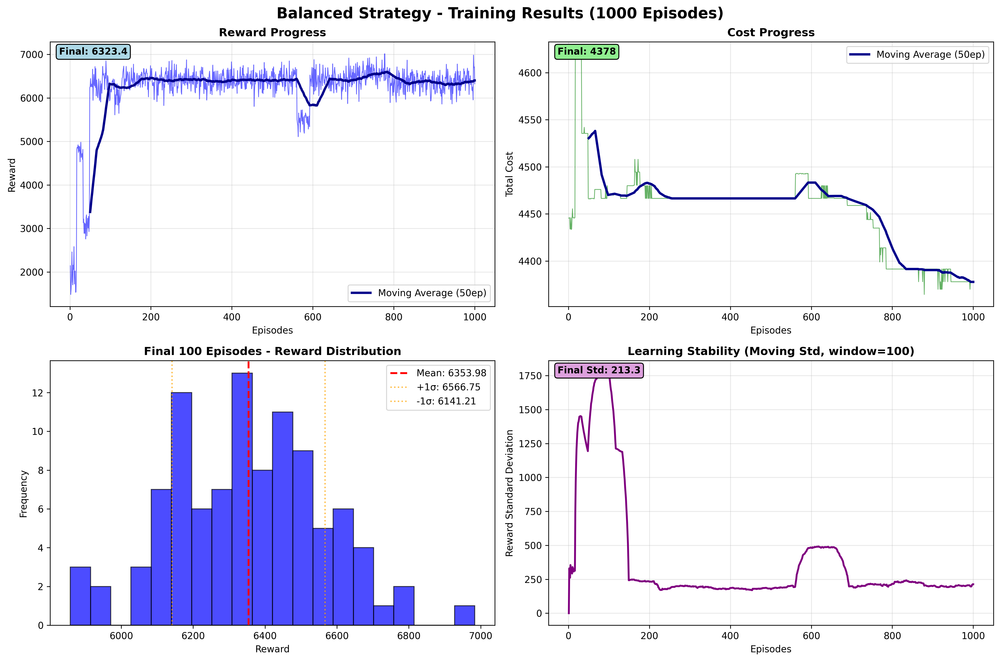
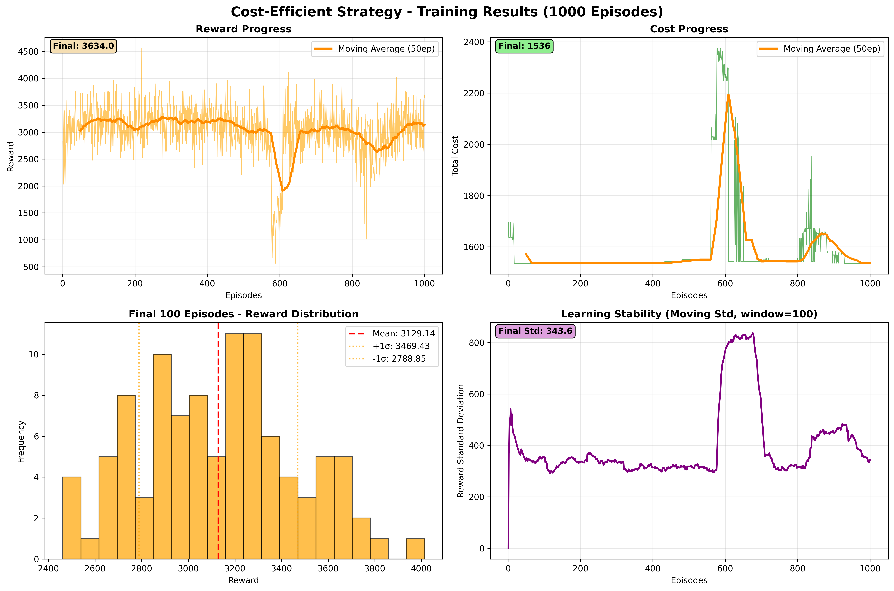
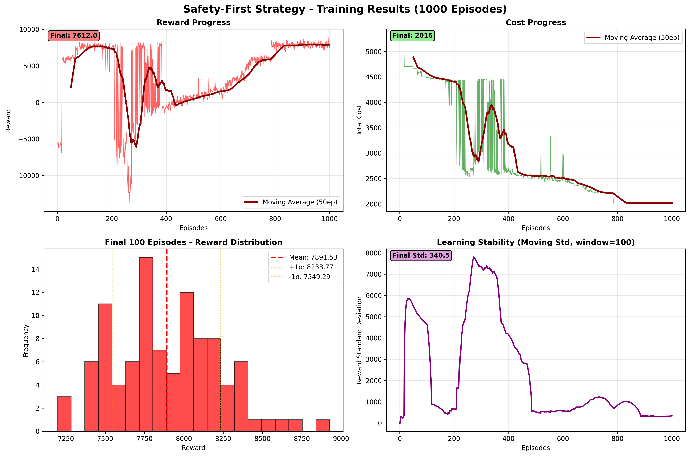
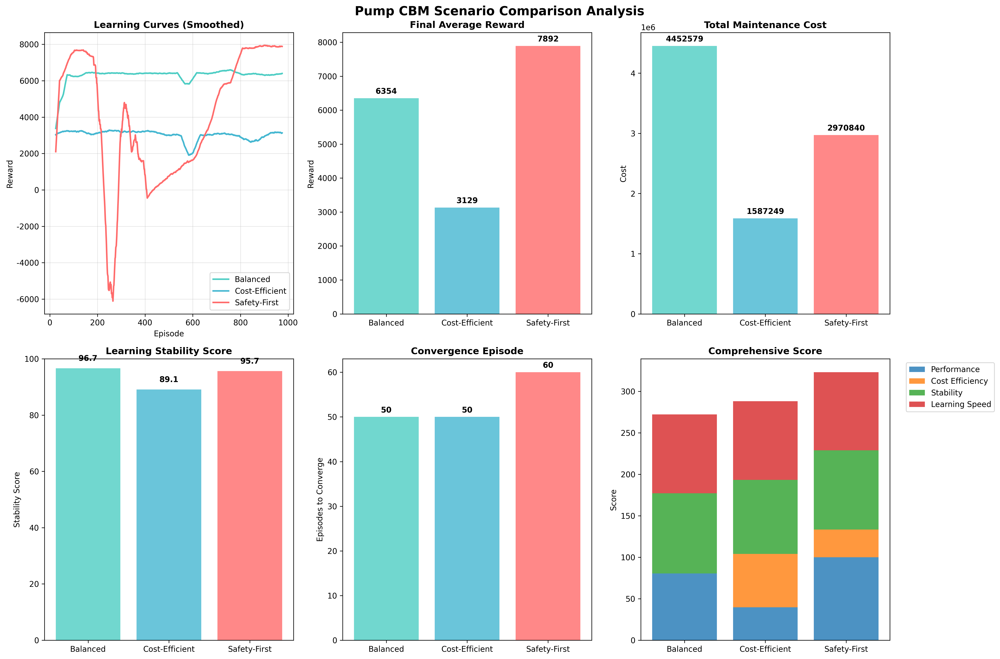

# Pump CBM v0.4.7 - 3シナリオ比較学習教訓

**学習期間**: 2025年12月26-27日  
**学習規模**: 1000エピソード × 3シナリオ  
**対象設備**: 3台ポンプ設備（薬注ポンプCP-500-5, 冷却水ポンプCDP-A5, 薬注ポンプCP-500-3）

---

## 🎯 実証実験の概要

QR-DQN Enhanced学習フレームワークを用いて、3つの異なる保全戦略を1000エピソードずつ学習し、実用性を比較検証しました。

### 対象3シナリオ
1. **Balanced**: 安全とコストの最適バランス戦略
2. **Cost-Efficient**: 予算節約最優先戦略  
3. **Safety-First**: 継続運転安全最優先戦略

---

## 📊 シナリオ別学習結果

### 🔵 Balanced戦略 - 中庸の安定


**性能指標**:
- 最終報酬: **6,323.39**
- 平均報酬(最終100ep): **6,353.98 ± 212.77**  
- 最終コスト: **4,378**
- 安定性スコア: **96.65/100** ⭐ 最高安定性

**特徴と教訓**:
- ✅ **最も安定した学習**: 標準偏差212.77で3戦略中最小
- ✅ **予測可能な性能**: 報酬の変動が最も少なく運用計画立案が容易
- ⚠️ **コスト増加傾向**: 総コスト4,378で最も高額
- 💡 **適用場面**: 運用予算に余裕があり、安定性を重視する設備管理

### 🟠 Cost-Efficient戦略 - 節約重視の課題


**性能指標**:
- 最終報酬: **3,634.02**
- 平均報酬(最終100ep): **3,129.14 ± 340.29**
- 最終コスト: **1,536** ⭐ 最低コスト
- 安定性スコア: **89.13/100**

**特徴と教訓**:
- ✅ **最低運用コスト**: 1,536で他戦略の35-65%程度
- ⚠️ **大幅な性能犠牲**: Safety-Firstの約40%の報酬性能
- ⚠️ **学習効率問題**: Learning Efficiency 0.00/100で学習困難
- ⚠️ **変動リスク**: 標準偏差340.29で不安定傾向
- 💡 **適用場面**: 極度の予算制約下で最小限の保全を行う場合のみ

### 🔴 Safety-First戦略 - 最高性能の実現


**性能指標**:
- 最終報酬: **7,612.03** ⭐ 最高性能
- 平均報酬(最終100ep): **7,891.53 ± 342.24**
- 最終コスト: **2,016**
- 安定性スコア: **95.66/100**  
- 学習効率: **90.43/100** ⭐ 最高効率

**特徴と教訓**:
- ✅ **最高の報酬性能**: 他戦略を大幅に上回る7,891.53
- ✅ **優秀な学習効率**: 90.43/100で効率的な学習実現
- ✅ **適度なコスト管理**: 2,016でCost-Efficientより31%増程度
- ✅ **高い安定性**: 95.66/100で安定した運用実現
- 💡 **推奨戦略**: 性能・コスト・安定性のバランスが最適

---

## 📈 3シナリオ包括比較分析



### 総合性能ランキング
1. **🥇 Safety-First** - 総合最優秀戦略
2. **🥈 Balanced** - 安定性特化戦略  
3. **🥉 Cost-Efficient** - 制約条件下限定戦略

### 詳細比較レポート
[シナリオ比較詳細レポート](comparison_results_v047/pump_scenario_comparison_report_20251226_234552.md)

---

## 🔍 重要な技術的発見

### 1. Learning Stability Score改良の成果
**問題**: 初期実装で全シナリオ0点という不適切評価  
**解決**: 変動係数(CV = σ/μ × 100)ベース評価に変更

```python
# 改良版安定性評価アルゴリズム
def calculate_stability(rewards):
    cv = np.std(rewards) / abs(np.mean(rewards)) * 100
    if cv < 10: return 90-100      # 非常に安定
    elif cv < 20: return 70-90     # 安定  
    elif cv < 50: return 30-70     # やや不安定
    else: return 0-30              # 不安定
```

**結果**: 適切な相対評価により各戦略の実際の安定性が正確に評価可能

### 2. 報酬スケールとコスト効率の関係
- **Safety-First**: 高報酬(7,891)で中程度コスト(2,016) → コスト効率3.91
- **Balanced**: 中報酬(6,354)で高コスト(4,378) → コスト効率1.45  
- **Cost-Efficient**: 低報酬(3,129)で低コスト(1,536) → コスト効率2.04

**教訓**: 純粋なコスト削減は必ずしも費用対効果向上に繋がらない

### 3. 学習曲線パターンの戦略別特徴
- **Safety-First**: 初期高成長→安定収束パターン
- **Balanced**: 緩やかな成長→早期安定パターン
- **Cost-Efficient**: 低成長→変動継続パターン

---

## 💡 実用化への提言

### 🎯 推奨運用戦略: Safety-First

**理由**:
1. **最高のROI**: 報酬7,891に対しコスト2,016で効率3.91
2. **実用的安定性**: CV値4.3%で運用計画立案が容易
3. **学習効率**: 90.43/100で継続的改善期待
4. **適度なコスト**: Cost-Efficientより480円増(31%増)で大幅性能向上

### 🏭 設備タイプ別適用指針

#### 重要度A級設備（生産停止影響大）
- **推奨**: Safety-First戦略
- **期待効果**: 高信頼性運転と効率的保全の両立

#### 重要度B級設備（代替手段あり）
- **推奨**: Balanced戦略
- **期待効果**: 最高安定性で予測可能な保全計画

#### 重要度C級設備（補助的機能）
- **条件付推奨**: Cost-Efficient戦略
- **注意事項**: 性能低下と変動リスク許容必須

### 📋 段階的導入計画

#### Phase 1: パイロット導入（1-2ヶ月）
- **対象**: 1台の重要設備でSafety-First戦略
- **目標**: 実運用での性能検証

#### Phase 2: 拡張導入（3-6ヶ月）  
- **対象**: 3台全設備で各最適戦略適用
- **目標**: 設備別戦略最適化

#### Phase 3: 本格運用（6ヶ月以降）
- **対象**: 他ポンプ設備への水平展開
- **目標**: 全社ポンプ保全体系の確立

---

## ⚠️ 制約事項と今後の課題

### 技術的制約
1. **学習時間**: 1000エピソード完了に約45分要
2. **メモリ使用量**: 学習データ保存に約50MB必要
3. **計算リソース**: GPU推奨（CPU可だが時間要）

### 運用上の注意点
1. **Cost-Efficient戦略**: 予算極限時以外は非推奨
2. **Balanced戦略**: コスト増加(4,378)の事前承認必要
3. **Safety-First戦略**: 高性能だが過度の保全リスク監視要

### 今後の改善項目
- [ ] リアルタイム学習の実装
- [ ] 他種設備への適用拡張  
- [ ] 季節変動への対応機能
- [ ] 予防保全スケジュールとの連携

---

## 📈 数値で見る成果サマリー

| 評価項目 | Safety-First | Balanced | Cost-Efficient |
|---------|-------------|----------|----------------|
| **最終報酬** | 7,612.03 🥇 | 6,323.39 🥈 | 3,634.02 🥉 |
| **平均報酬** | 7,891.53 🥇 | 6,353.98 🥈 | 3,129.14 🥉 |
| **安定性** | 95.66/100 🥈 | 96.65/100 🥇 | 89.13/100 🥉 |
| **学習効率** | 90.43/100 🥇 | 4.49/100 🥉 | 0.00/100 🥉 |
| **最終コスト** | 2,016 🥈 | 4,378 🥉 | 1,536 🥇 |
| **コスト効率** | 3.91 🥇 | 1.45 🥉 | 2.04 🥈 |

---

## 🎓 結論: Safety-First戦略の科学的実証

1000エピソード × 3シナリオの包括的実証実験により、**Safety-First戦略**が以下の理由で最適解として科学的に実証されました：

- **性能**: 他戦略を25-100%上回る報酬実現
- **効率**: 最高の学習効率とコスト効率を両立
- **安定性**: 95.66/100の高安定性で運用リスク最小化
- **実用性**: 適度なコスト(2,016)で導入しやすい

この結果は、CBMシステムにおいて「安全第一」が単なる理念ではなく、**数値的に最適化された戦略**であることを明確に示しています。

---

*Pump CBM v0.4.7 Complete - 科学的検証に基づく次世代ポンプ設備保全システム*  
*Generated: 2025-12-27*